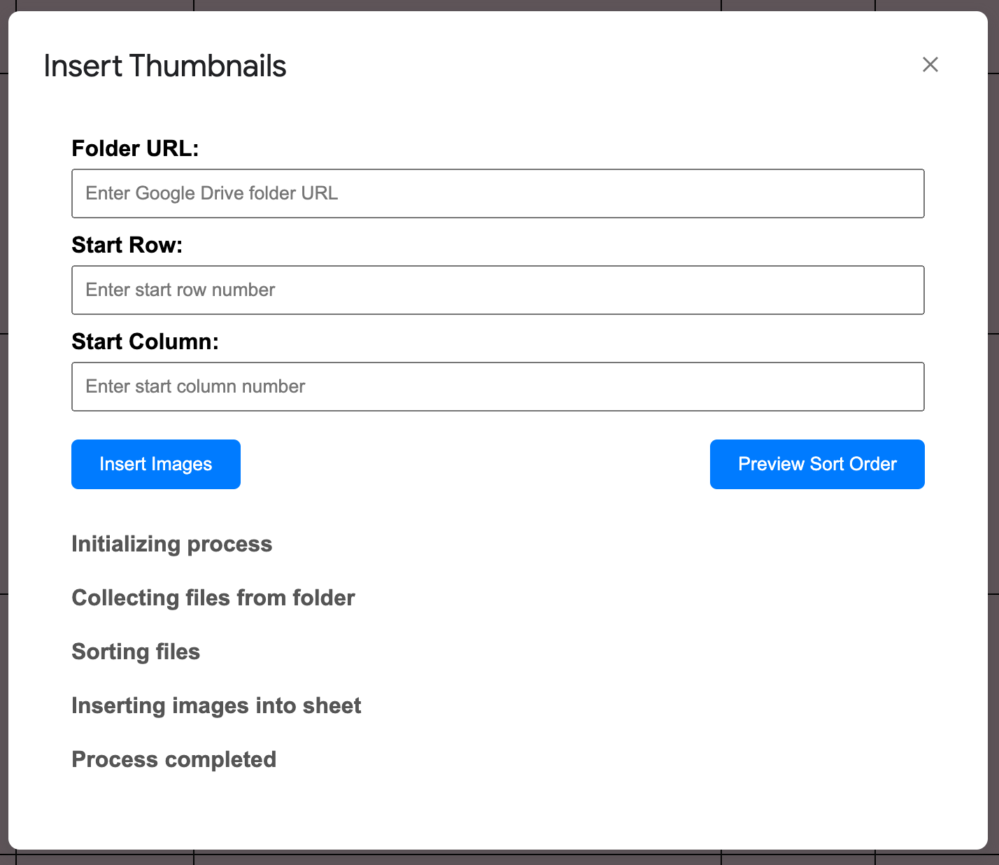

# App Script - Insert Thumbnails from GDrive into Google Sheet

- This Google Apps Script allows users to insert images from a specified Google Drive folder into a Google Sheet.
- Users can specify the start row and column for the images to be inserted.
- The script resizes the images to ensure file sizes don't go out of control whilst maintaining image quality.

## Screenshot

## Installation

### Step 1: Create a Google Sheet

1. Open [Google Sheets](https://sheets.google.com).
2. Create a new Google Sheet or open an existing one.

### Step 2: Open the Script Editor

1. In your Google Sheet, click on `Extensions` in the menu bar.
2. Select `Apps Script` from the dropdown menu. This will open the Apps Script editor in a new tab.

### Step 3: Add the Main Code

1. In the Apps Script editor, delete any code in the `Code.gs` file under the `Files` section.
2. Copy and paste the code from the [Code.gs](Code.gs) file in this repo into the `Code.gs` file:
3. Save the script by clicking the disk icon or by pressing `Ctrl + S`.

### Step 4: Add the Script Dependencies

1. In the Apps Script editor, click on the `+` button next to the `Libraries` section.
2. Paste the following code into the 'Script ID' field:
`1T03nYHRho6XMWYcaumClcWr6ble65mAT8OLJqRFJ5lukPVogAN2NDl-y`
3. Click 'Look Up'
4. Click 'Add'

### Step 5: Create the HTML UI File

1. In the Apps Script editor, click on the `+` button next to the `Files` section.
2. Select `HTML` and name the file `Index`.
3. Copy and paste the code from the [Index.html](Index.html) file in this repo into the `Index.html` file:
4. Save the HTML file by clicking the disk icon or by pressing `Ctrl + S`.

### Step 6: Run the Add-on

1. Go back to your Google Sheet, you can close the Apps Script editor tab if you wish.
2. Refresh the web page (by clicking the refresh icon or by pressing `Ctrl + R`).
3. Click on the new `Custom Menu` button in the menu bar.
4. Select `Insert Thumbnails from GDrive`.
 - On first run, in that Sheet, you may be prompted to authorise access to your Google Drive by the script.
5. In the "Folder URL" field, enter the URL of the Google Drive folder containing the images.
 - For example: `https://drive.google.com/drive/folders/1bRNBR55227gdQc-3_jhfsef_5R80RjAt` < Not a real URL
6. In the "Start Row" and "Start Column" fields, enter the starting row and column for the images to be inserted.
7. Click `Insert Images` to begin the process.
- Once the script starts running, you'll be able to press Stop to stop the script.
- Additionally as the script runs it'll show a checklist of progress under the Stop button.
- **NOTE: The script will NOT stop running if you close the window, only if you press the Stop button.**

## Notes

- Ensure that the images in the Google Drive folder are accessible.
- The script might require authorisation to access your Google Drive and Google Sheets.
- ImgApp.js has been added for archiving purposes if the library is removed from App Scripts.

## License

This project is licensed under the GPLv3 License - see the [LICENSE](LICENSE) file for details.

## Acknowledgments

This project uses the `ImgApp.js` library, created by Tanaike, for image resizing only.
You can find the original library and more information about it on the [ImgApp GitHub repository](https://github.com/tanaikech/ImgApp).