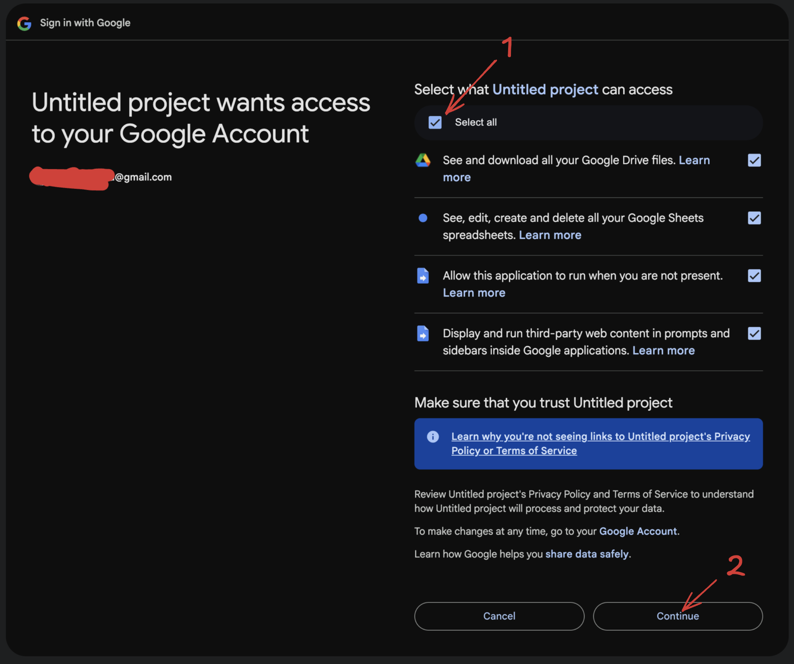

# App Script - Insert Thumbnails from GDrive into Google Sheet

This Google Apps Script allows users to insert images from a specified Google Drive folder into a Google Sheet.

###  Features

- **Preview Sort Order**: Before inserting images, you can preview the order in which files will be sorted.
- **Batch Processing**: The script processes images in batches to handle large numbers of files efficiently, 75 images at a time.
- **Progress Tracking**: A checklist shows the current stage of the process.
- **Resizing**: Images are automatically resized to maintain quality while keeping file sizes manageable.

 

## Installation

### Step 1: Create a Google Sheet

1. Open [Google Sheets](https://sheets.google.com).
2. Create a new Google Sheet or open an existing one.

### Step 2: Open the Script Editor

1. In your Google Sheet, click on `Extensions` in the menu bar.
2. Select `Apps Script` from the dropdown menu. This will open the Apps Script editor in a new tab.

### Step 3: Add the Main Code

1. In the Apps Script editor, delete any code in the `Code.gs` file under the `Files` section.
2. Copy and paste the code from the [Code.gs](Code.gs) file in this repo into the `Code.gs` file.
3. Save the script by clicking the disk icon or by pressing `Ctrl + S` (`Cmd + S` on Mac).

### Step 4: Create the HTML UI File

1. In the Apps Script editor, click on the `+` button next to the `Files` section.
2. Select `HTML` and name the file `index`. (must be lowercase, do not include an extension).
3. Copy and paste the code from the [index.html](Index.html) file in this repo into the `Index.html` file:
4. Save the HTML file by clicking the disk icon or by pressing `Ctrl + S` (`Cmd + S` on Mac).

### Step 5: Run the Add-on

1. Go back to your Google Sheet, you can close the Apps Script editor tab if you wish.
2. Refresh the web page (by clicking the refresh icon or by pressing `Ctrl + R` or `Cmd + R` on Mac).
3. Click on the new `Custom Tools` button in the menu bar.
4. Select `Insert Thumbnails from GDrive`.
 - On first run, in that Sheet, you may be prompted to authorise access to your Google Drive by the script (see [Security Prompt](#Security-Prompt)).
5. In the "Folder URL" field, enter the URL of the Google Drive folder containing the images.
 - For example: `https://drive.google.com/drive/folders/1bRNBR55227gdQc-3_jhfsef_5R80RjAt` < Not a real URL
6. In the "Start Row" and "Start Column" fields, enter the starting row and column for the images to be inserted.
7. Click `Insert Images` to begin the process.
- Once the script starts running, you'll be able to press Stop to stop the script.
- Additionally as the script runs it'll show a checklist of progress under the Stop button.
- **NOTE: The script will NOT stop running if you close the window, only if you press the Stop button.**

## Security Prompt
#### On first run, in that Sheet, you may be prompted to authorise access to your Google Drive by the script.
Up to you if you feel like the security is too permissive, the full code is here to see and audit.

| 1. Click Show Advanced 2. Click "Go to Insert Thumbnails from GDrive"  |  |
| -------- | ------- |
| This page explains that the script will need access to the following: 1. **Google Drive** To access the folder, and **ONLY** the folder, containing the images  2. **Google Sheets** To insert the images into the sheet, and **ONLY** the sheet you run the script in  3. **"Allow this app to run when you are not present"** is needed because the process for inserting images can take a long time Potentially 10+ minutes for hundreds of images. So the tool runs the process in the background and in batches.  4. **"Display and run third-party web content[...]"** is needed to show you the UI for the script.    |  |

## Troubleshooting

If you encounter any issues:
1. Make sure you have the necessary permissions for both the Google Sheet and the Google Drive folder.
2. Check that the folder URL is correct and accessible.
3. If the script stops unexpectedly, try running it again. There may be temporary issues with Google's services.

## License

This project is licensed under the GPLv3 License - see the [LICENSE](LICENSE) file for details.
